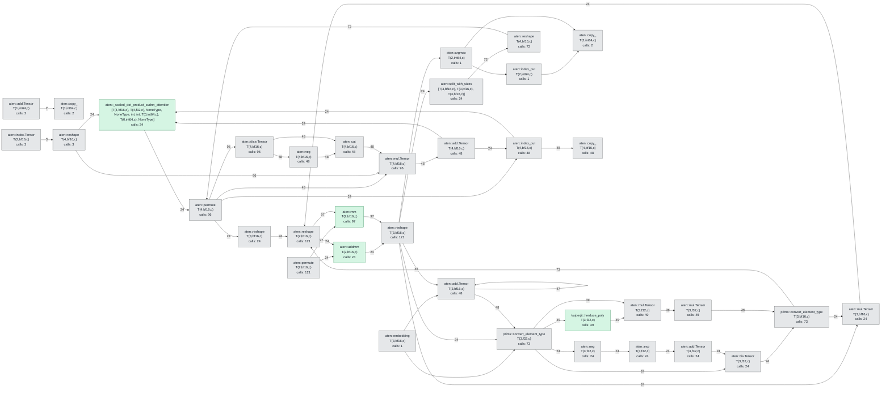

# Kernel implementation checklist

Auto-generated from the compiled pipeline by `infer.py --dump-kernels`.
Each row is an ATen op the Inductor graph executed; **Kuiper?** marks the
ops served by a verified `kuiperjit::*` kernel (the rest fall back to
Triton / cuBLAS / cuDNN).

## Kernel dependency graph

Each node is a unique operator signature; repeated calls are collapsed.
Edges show observed data dependencies and are labelled when repeated.
Green nodes use Kuiper kernels and gray nodes use the fallback backend.

## Kernel inventory

| Op | Args | Out | Kuiper? |
| -- | ---- | --- | ------- |
| aten::_scaled_dot_product_cudnn_attention | T(4,bf16,c), T(4,bf16,c), T(4,bf16,c), T(4,bf16,c), False | scale=float | [T(4,bf16,c), T(4,f32,c), NoneType, NoneType, int, int, T(0,int64,c), T(0,int64,c), NoneType] | yes |
| aten::addmm | T(1,bf16,c), T(2,bf16,c), T(2,bf16,c) | T(2,bf16,c) | yes |
| aten::mm | T(2,bf16,c), T(2,bf16,c) | T(2,bf16,c) | yes |
| kuiperjit::hreduce_poly | T(3,f32,c), str, int, True, NoneType, str, str | T(3,f32,c) | yes |
| aten::add.Tensor | T(4,bf16,c), T(4,bf16,c) | T(4,bf16,c) |  |
| aten::add.Tensor | T(3,bf16,c), T(3,bf16,c) | T(3,bf16,c) |  |
| aten::add.Tensor | T(3,f32,c), int | T(3,f32,c) |  |
| aten::add.Tensor | T(1,int64,c), int | T(1,int64,c) |  |
| aten::argmax | T(3,bf16,c), int | T(2,int64,c) |  |
| aten::cat | [T(4,bf16,c), T(4,bf16,c)], int | T(4,bf16,c) |  |
| aten::copy_ | T(1,int64,c), T(1,int64,c) | T(1,int64,c) |  |
| aten::copy_ | T(2,int64,c), T(2,int64,c) | T(2,int64,c) |  |
| aten::copy_ | T(4,bf16,c), T(4,bf16,c) | T(4,bf16,c) |  |
| aten::div.Tensor | T(3,f32,c), T(3,f32,c) | T(3,f32,c) |  |
| aten::embedding | T(2,bf16,c), T(2,int64,c) | T(3,bf16,c) |  |
| aten::exp | T(3,f32,c) | T(3,f32,c) |  |
| aten::index.Tensor | T(2,bf16,c), [T(1,int64,c)] | T(2,bf16,c) |  |
| aten::index_put | T(4,bf16,c), [NoneType, NoneType, T(1,int64,c)], T(4,bf16,c) | T(4,bf16,c) |  |
| aten::index_put | T(2,int64,c), [NoneType, T(1,int64,c)], T(2,int64,c) | T(2,int64,c) |  |
| aten::mul.Tensor | T(3,f32,c), T(3,f32,c) | T(3,f32,c) |  |
| aten::mul.Tensor | T(3,f32,c), T(1,bf16,c) | T(3,f32,c) |  |
| aten::mul.Tensor | T(4,bf16,c), T(4,bf16,c) | T(4,bf16,c) |  |
| aten::mul.Tensor | T(3,bf16,c), T(3,bf16,c) | T(3,bf16,c) |  |
| aten::neg | T(4,bf16,c) | T(4,bf16,c) |  |
| aten::neg | T(3,f32,c) | T(3,f32,c) |  |
| aten::permute | T(2,bf16,c), [int, int] | T(2,bf16,c) |  |
| aten::permute | T(4,bf16,c), [int, int, int, int] | T(4,bf16,c) |  |
| aten::reshape | T(3,bf16,c), [int, int] | T(2,bf16,c) |  |
| aten::reshape | T(2,bf16,c), [int, int, int] | T(3,bf16,c) |  |
| aten::reshape | T(3,bf16,c), [int, int, int, int] | T(4,bf16,c) |  |
| aten::reshape | T(2,bf16,c), [int, int, int, int] | T(4,bf16,c) |  |
| aten::reshape | T(4,bf16,c), [int, int, int] | T(3,bf16,c) |  |
| aten::slice.Tensor | T(4,bf16,c), int, int, int | T(4,bf16,c) |  |
| aten::split_with_sizes | T(3,bf16,c), [int, int, int], int | [T(3,bf16,c), T(3,bf16,c), T(3,bf16,c)] |  |
| prims::convert_element_type | T(3,bf16,c), f32 | T(3,f32,c) |  |
| prims::convert_element_type | T(3,f32,c), bf16 | T(3,bf16,c) |  |
