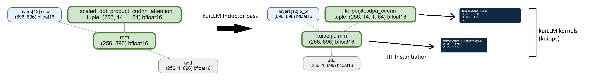

# kuiLLM

A set of verified, memory-safe Kuiper kernels for LLM inference, and a PyTorch backend that automatically maps operators to those kernels. The PyTorch part is structured as an Inductor pass that replaces suitable operators in the graph with Kuiper implementations. These nodes are then dispatched to JIT-verified, extracted, and compiled Kuiper kernels at runtime (during CUDA graph capture to be specific). kuiLLM also supports autotuning operators based on the supported parameter space.



Using the kuiLLM backend is simply a matter of: 

```python
import torch
import kuipy
kuipy.enable() # hooks in Inductor backend
```

## Formal verification

kuiLLM is checked against the fixed Kuiper nightly recorded by
`KUIPER_NIGHTLY` in `kuiper.mk`. The package contains the corresponding F*,
Pulse, Karamel, extraction plugin, checked Kuiper library, and CUDA headers.
No Kuiper source checkout is required.

```bash
make -j$(nproc) prepare
make -j$(nproc) verify-kuiops
```

The first command downloads the package into the ignored `.kuiper/` directory.
Set `KUIPER_HOME=/path/to/package` to use an existing binary package. Continuous
integration runs this formal verification on hosted CPU machines; it does not
need CUDA or a GPU.

The Python integration and numerical comparisons require a CUDA system with a
matching host toolkit. They can be run independently with `make test` and
`make verify`. These experiments complement the formal verification but are
not its basis.

## Organization

- `kuipy/`: The Python code that supports JIT extraction, compilation, etc. and all the 
  glue needed to hook up the CUDA code to ATen/PyTorch-compatible Python operators. Some highlights:
  - `kuipy/kuiops.py` holds one `*Impl` class per operator family (subclasses of
    `_Family`). `supported()` returns `None` if no kernel parameterization fits,
    else a spec; `run()` instantiates templates, compiles via `_mod`, and invokes.
  - `kuipy/registry.py` maps each aten op to its family; `kuipy.run(op, **kwargs)`
    returns a drop-in replacement for `op` that always goes through the Kuiper
    kernel (raising instead of falling back), which is what tests and benchmarks use.
  - `kuipy/unverified/` holds unverified CUDA kernels used as benchmarking
    references (see its docstring for conventions).
  - `kuipy/benchmarking.py` is the generic benchmark driver; the benchmarks
    themselves live in `bench_ops.ipynb` at the repo root.
- `kuiops/`: Where the supporting F* and CUDA files for each operator lives. Each
   operator lives in `kuiops/<op>` and gets a `Kuiops.<Op>.Inst.fst.j2` (F*
   instantiation) and `wrapper_<op>.cu.j2` (Torch-tensor glue). Support F* code
   lives in `kuiops/Kuiops.<Op>.fst{i}`. These Jinja templates are what produce 
   the specialized kernel from the information available in the Python context.
   The fstar template gets extracted to CUDA and then linked against the cuda/C++ wrapper 
   that exposes a Torch::Tensor compatible interface.
    - `kuiops/common` has generic kernel implementations and other reusable functions between different operators. Project-owned extensions use the `Kuiops` namespace so they cannot shadow modules supplied by the Kuiper package.
- `etc/`: Experiments and miscellaneous support files.
- `tests/`: Unit tests for kuipy.
- `infer.py`: Where the main Qwen2.5 integration test lives.
- `bench_ops.ipynb`: Kernel benchmarks (verified + unverified) against stock PyTorch.

## Details (all AI generated from here on)

How the pieces actually fit together. Engineering specifics — build targets,
environment flags, naming conventions, coding rules — are in
`.github/copilot-instructions.md` and not repeated here.

### End to end

```
  model                                                    (1) compile time
    |  torch.compile(mode="reduce-overhead")
    v
  FX post-grad graph  --------------------------------.
    |                                                 |
    |  KuiperPostGradPass                             |  for each claimed node
    |    1. user fusion rules                         |
    |    2. map fusion: absorb elementwise nodes      |
    |       into a kernel's pre_map / post_map        |
    |    3. replace claimed aten node -> kuiperjit::* |
    v                                                 v
  rewritten graph                             supported(args) -> spec
    |                                                 |
    |                                          (2) JIT, per spec
    |                                                 |
    |                                    Jinja: Kuiops.<Op>.Inst.fst.j2
    |                                                 |  monomorphic .fst
    |                                                 v
    |                                            F* + Pulse
    |                                                 |  extract (Karamel)
    |                                                 v
    |                                              .cu  +  wrapper_<op>.cu.j2
    |                                                 |  nvcc
    |                                                 v
    |                                          cached .so  (.kuipy_cache/)
    v                                                 |
  CUDA graph capture  <------------------------------'
    |
    v
  replay per decode step                                   (3) run time
```

Two things are happening at once, and it helps to keep them separate. Path (1)
is PyTorch's ordinary compile flow, into which one pass is inserted. Path (2) is
the Kuiper JIT, which turns a *generic, already-proven* kernel into a
monomorphic CUDA one. They meet because the pass can only claim a node if the
JIT can produce a kernel for it.

### The Inductor pass

`torch.compile` traces the model, decomposes and functionalizes it, and hands
Inductor a post-grad FX graph of ATen operators.
`kuipy.inductor.passes.KuiperPostGradPass` is registered as
`post_grad_custom_post_pass` and mutates that graph in place.

Post-grad is the useful place to intervene: the graph is canonicalized, so there
is a small set of operator forms to match instead of the whole Python API. The
pass runs fusion first and replacement second, because fusion changes what a
single kernel can absorb:

- **Map fusion** (`inductor/fusion.py`) walks outward from each *anchor* — an op
  whose family accepts `pre_map` / `post_map` — and greedily swallows the
  elementwise chain feeding it and the chain it feeds. A node is eligible when
  it is unary (or binary against a compile-time constant), preserves dtype and
  shape, and is single-use, so nothing observable elsewhere disappears. These
  become arguments *inside* the kernel, at no extra memory traffic.
- **Replacement** then swaps each claimed node for a `kuiperjit::*` custom op.
  `custom_ops.claim` is the single definition of coverage, shared with the
  tracer so both agree.

Inductor treats `kuiperjit::*` ops as opaque externs: it schedules them, plans
their outputs, and records them into `reduce-overhead` CUDA graphs.

### The JIT

Kuiper kernels are generic in ways CUDA cannot express: in element type, in the
*layout* of each operand (row major, column major, a strided subtile, a
transposed view), in the accumulator type, and in the maps mentioned above. That
genericity is what makes one proof cover every use — `mm`, `addmm` and a fused
activation are one kernel at three instantiations — and it is exactly what must
be erased before code generation.

Erasing it needs the concrete types, layouts and tile sizes, which only exist
once the operator is called with real tensors. So specialization runs at
runtime, per unique parameterization:

    supported()  -> is there a legal parameterization for these inputs?  (spec, or None)
    Jinja        -> emit a monomorphic F* instantiation from the spec
    F*           -> typecheck, then extract to CUDA
    nvcc         -> compile with the Torch-tensor wrapper, cache the .so

Each operator contributes two templates, `Kuiops.<Op>.Inst.fst.j2` (the
instantiation) and `wrapper_<op>.cu.j2` (the `torch::Tensor` glue). Templates
stay free of proof content — anything with real obligations lives in a support
module beside them, so the JIT does not re-verify it per instantiation. Cold
cost is tens of seconds per new parameterization; afterwards it is a dict
lookup, and a model has only a handful of distinct shapes.

By default the JIT *admits* SMT queries at instantiation, since cold-compile
latency dominates and the generic proof is what carries the guarantee.
`KUIPY_JIT_VERIFY=1` re-verifies each instantiation; `make verify-kuiops` checks
the generic modules.

### CUDA graphs, and why there is a batch mode

Inference replays a captured CUDA graph, which constrains kernels sharply: no
synchronization, no allocation, no host-side decisions during capture. Hence
kernels take the caller's stream rather than creating one, never call
`cudaStreamSynchronize`, and never allocate their outputs — the wrapper
allocates (with the *kernel's* output dtype, which is not always the input's),
and families that internally launch and synchronize are marked
`graph_safe = False` and stay out of graphs.

Capture is also why compiling appears twice. Building each kernel separately
re-parses `torch/extension.h` every time, which dominates cold start. Under
`kuipy.batch_capture()` a first warm-up pass *only extracts* each matched
kernel, raises `CaptureDeferred`, and lets stock PyTorch produce the values; at
`finalize_capture` every queued wrapper fragment is concatenated into one
translation unit and built with all the device code in a single compile. The
graph is recorded afterwards, against the real kernels.

### The trust boundary

The proof covers the Kuiper kernel: memory safety, data-race freedom, and
agreement with its functional specification. The Python that selects a
parameterization and the C++ that unpacks `torch::Tensor` are *not* verified, so
they are kept as thin as possible, and two rules follow:

- `supported()` must accept **exactly** what the kernel's refinements allow. The
  source of truth is the typeclass constraint in the F\*, not a guess — too
  broad is unsound, too narrow silently leaves performance behind.
- Missing PyTorch semantics (broadcasting, layouts, edge-case dtypes) are fixed
  in the *kernel*, never patched in the wrapper. A wrapper that quietly
  transposes or copies is an unverified kernel wearing a verified one's name.

`make verify` runs inference with each dispatched op alongside its stock
reference and reports relative Frobenius divergence — an eager, non-captured
pass, since the comparison needs a host sync.

### Performance

Tile sizes, warp tiling and split-K are picked by an autotuner that benchmarks
the legal candidates per shape and records winners in `tune_params.json`;
ordinary runs only read it. Unverified CUDA implementations of the same kernels
live in `kuipy/unverified/` so the overhead of Kuiper itself can be measured
rather than guessed. `PERFORMANCE.md` tracks where the remaining gaps are and
which are artifacts of the framework — currently, for instance, Kuiper cannot
alias one shared-memory allocation over another's lifetime, which costs
occupancy in the largest GEMM.
